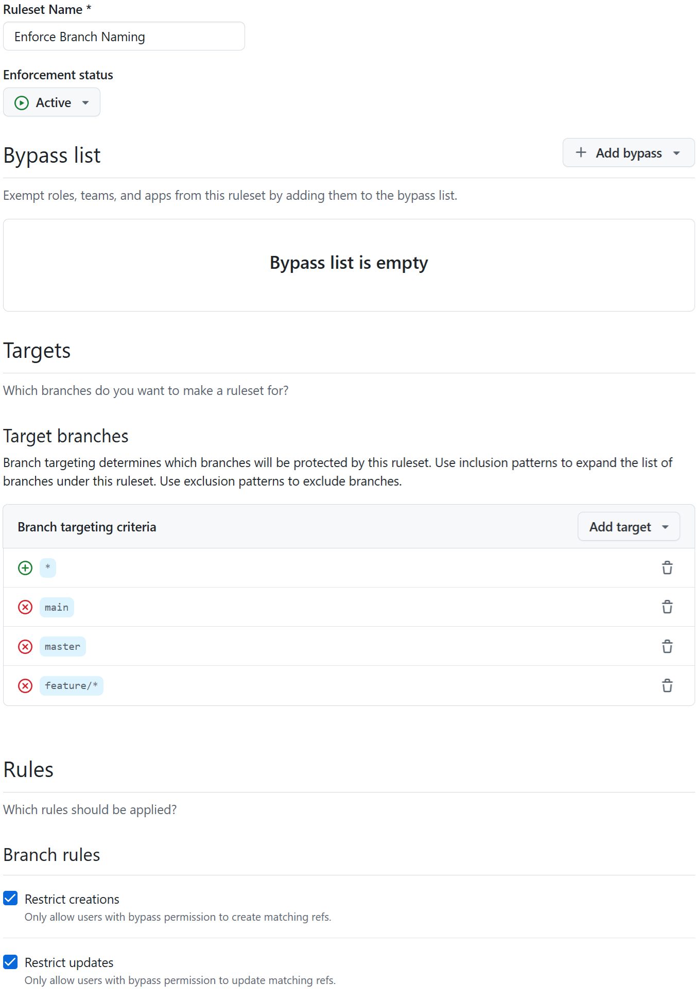

# WoPeD Git-Hooks

This repository serves as the centralized management of all WoPeD Git hooks. Git hooks for different technologies are developed separately in various subfolders following the naming convention `<tech>Hooks`. Other GitHub repositories can then incorporate the Git hooks for the technology they use.

## Content

- [Getting started](#getting-started)
  - [Initial integration of Git hooks into other GitHub repositories](#initial-integration-of-git-hooks-into-other-github-repositories)
    - [General steps](#general-steps)
    - [Repositories using Python](#repositories-using-python)
    - [Repositories using Java](#repositories-using-java)
    - [Repositories using Angular](#repositories-using-angular)
  - [Updating a repository with already integrated Git hooks](#updating-a-repository-with-already-integrated-git-hooks)
  - [Activating Git hooks after cloning a repository](#activating-git-hooks-after-cloning-a-repository)
    - [Repository using Python](#repository-using-python)
    - [Repository using Java](#repository-using-java)
    - [Repository using Angular](#repository-using-angular)
- [Contributing](#contributing)

# Getting started

## Initial integration of Git hooks into other GitHub repositories

### General steps

Create a branch ruleset for the repository:

- Set the enforcement status to `active`
- Add the following target branches:
  - Include all branches
  - Exclude by pattern `main`
  - Exclude by pattern `master`
  - Exclude by pattern `feature/*`
- Enable the following branch rules:
  - Restrict creations
  - Restrict updates

*compare to the following graphic:*

---



---

### Repositories using Python

1. Add submodule:

``` shell
git submodule add -b python-hooks-only git@github.com:woped/woped-git-hooks.git .woped-hooks
```

2. Commit and push changes

---

### Repositories using Java

1. Add plugin to `pom.xml`:

``` xml
<plugin>
    <groupId>com.diffplug.spotless</groupId>
    <artifactId>spotless-maven-plugin</artifactId>
    <version>2.44.4</version>
    <configuration>
        <formats>
            <format>
                <includes>
                    <include>*.md</include>
                    <include>.gitignore</include>
                </includes>
                <excludes>
                    <exclude>LICENSE.md</exclude>
                    <exclude>README.md</exclude>
                </excludes>
                <trimTrailingWhitespace />
                <endWithNewline />
                <indent>
                    <tabs>true</tabs>
                    <spacesPerTab>4</spacesPerTab>
                </indent>
            </format>
        </formats>
        <java>
            <importOrder />
            <removeUnusedImports />
            <googleJavaFormat>
                <version>1.27.0</version>
                <style>GOOGLE</style>
                <reflowLongStrings>true</reflowLongStrings>
                <groupArtifact>com.google.googlejavaformat:google-java-format</groupArtifact>
            </googleJavaFormat>
        </java>
    </configuration>
</plugin>
```

2. Add submodule:

``` shell
git submodule add -b java-hooks-only git@github.com:woped/woped-git-hooks.git .woped-hooks
```

3. Commit and push changes

---

### Repositories using Angular

1. Install dependencies:

``` shell
npm install --save-dev @commitlint/cli
npm install --save-dev @commitlint/config-conventional
npm install --save-dev husky
npm install --save-dev prettier
```

2. Add the prepare script to `package.json`:

``` json
  "scripts": {
    "prepare": "husky .woped-hooks/.husky"
  }
```

3. Add submodule:

``` shell
git submodule add -b angular-hooks-only git@github.com:woped/woped-git-hooks.git .woped-hooks
```

4. Commit and push changes

## Updating a repository with already integrated Git hooks

1. Update submodule:

``` shell
git submodule update --remote .woped-hooks
```

2. Commit and push changes

## Activating Git hooks after cloning a repository

### Repository using Python

#### Prerequisites

- none

#### Instructions

Set up Git hooks:

``` shell
pip install pre-commit
pre-commit install --hook-type commit-msg --config .woped-hooks/.pre-commit-config.yaml
pre-commit install --hook-type post-checkout --config .woped-hooks/.pre-commit-config.yaml
pre-commit install --config .woped-hooks/.pre-commit-config.yaml
```

### Repository using Java

#### Prerequisites

- Python

#### Instructions

Set up Git hooks:

``` shell
mvn clean install
pip install pre-commit
pre-commit install --hook-type commit-msg --config .woped-hooks/.pre-commit-config.yaml
pre-commit install --hook-type post-checkout --config .woped-hooks/.pre-commit-config.yaml
pre-commit install --config .woped-hooks/.pre-commit-config.yaml
```

### Repository using Angular

#### Prerequisites

- none

#### Instructions

Set up Git hooks:

``` shell
npm run prepare
```

# Contributing

> **Note:**  
> Please do **not** develop on the `<tech>-hooks-only` branches.  
> All changes on these branches will be automatically overwritten by a workflow.

Please have a look at the [contributing guidelines](.github/CONTRIBUTING.md) before you start development.
